# A step-by-step guide

This guide will create a new portfolio file in Portfolio Performance (PP) and import a converted CSV file.

1. Download a transcations CSV file from your Charles Schwab account, say, ```example.csv```.
2. Convert the CSV. [README](../README.md) for convert.py.

```sh
python3 convert.py example.csv -p example_out.csv
```

3. Open Portfolio Performance and click on "Create a new file".

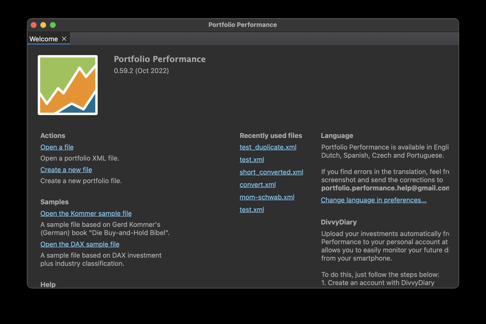

4. Select "USD (United States Dollar)" for currency.

' for currency.")

5. Type "Securities" for Securities Account and "Deposit" for Reference Account. Then click on "Add" button.

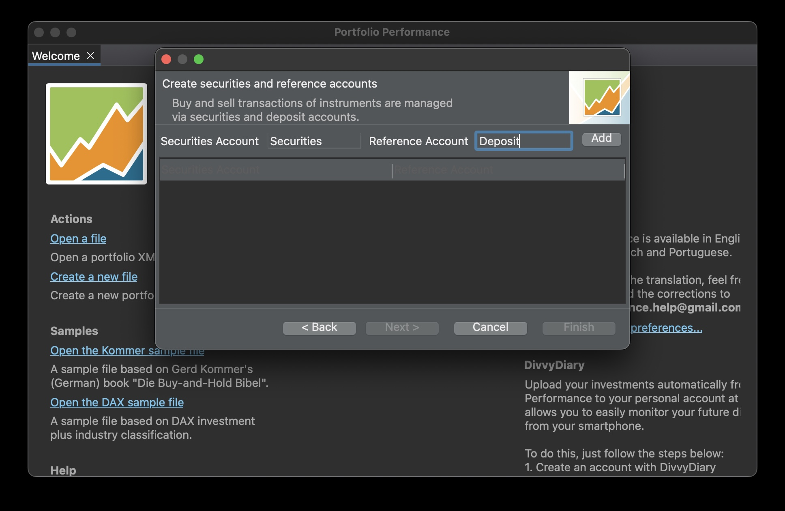

6. Click on "Finish" button.


7. Import the converted CSV. Go to File menu, Import, CSV files (comma-seperated values) and select ```example_out.csv```.

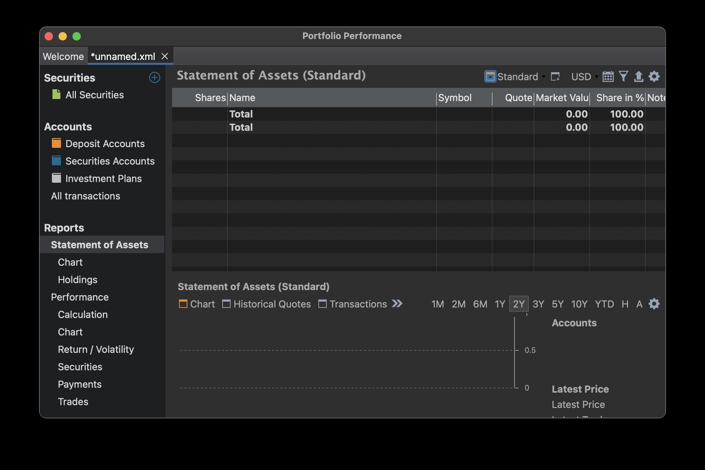

8. Click on "Next" button.

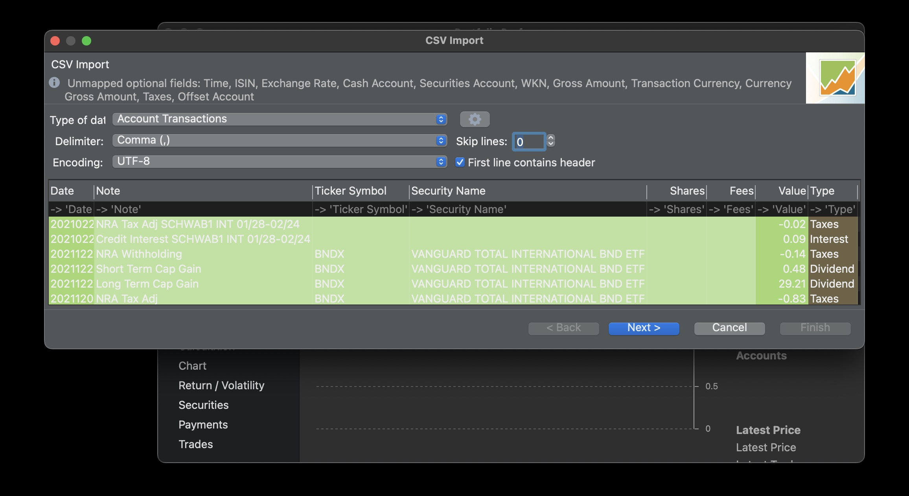

9. Note that "Deposit" is chosen as the Cash Account and "Securities" as the Securities Account. These two names where entered in a previous step. Click on "Finish" button.

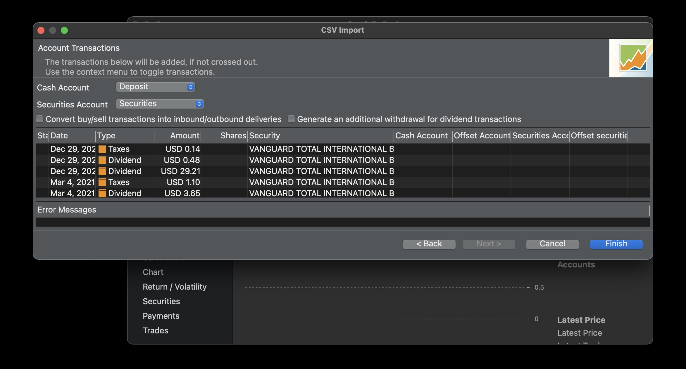

10. Now we are going to setup online retrieval of securities quotes for the securities in the account. 

    1. To have online quotes, we need to access an online service via its API key. FinnHub, among others, are supported by PP. Create an account on [Finnhub](https://finnhub.io/) and get your API key.

    2. Enter this API key at Preferences, API Keys, Finnhub, Finnhub API Key. You only need to enter an API key once. New portfolio files created in PP will be able to use it.

    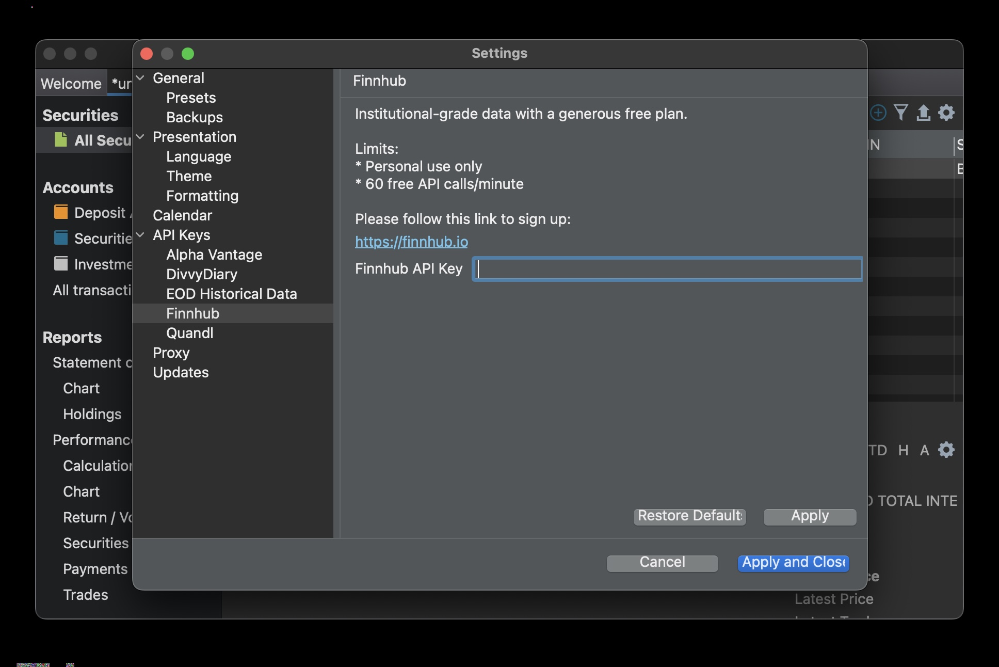

11. Now we are going to activate online quotes for securities that exist in the account.

    1. Select "All Securities" from the tree menu on the left panel.

    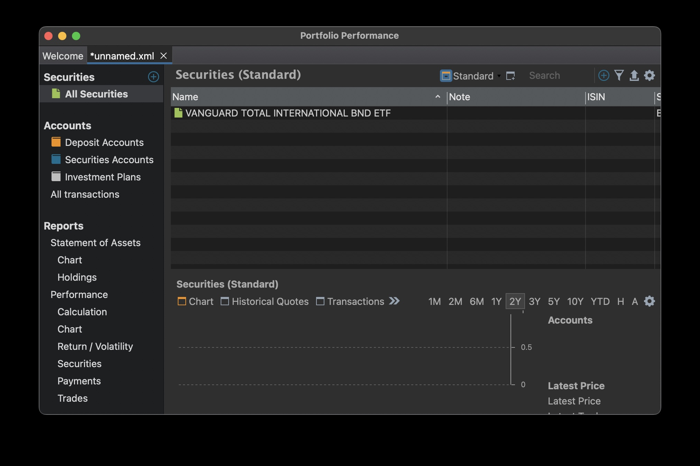

    2. Right click on "VANGUARD TOTAL INTERNATIONAL BND ETF" and choose "Edit".

    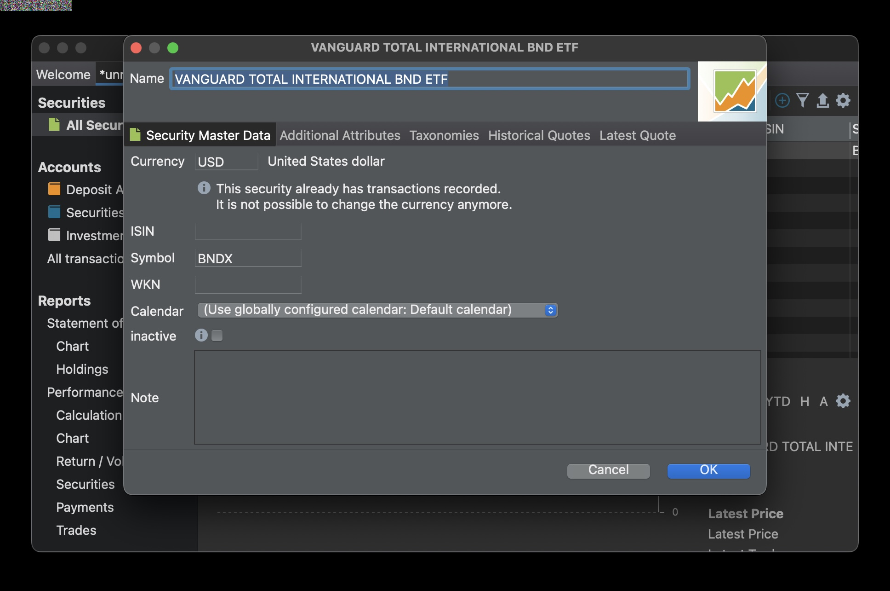

    3. Select "Historical Quotes" tab.

    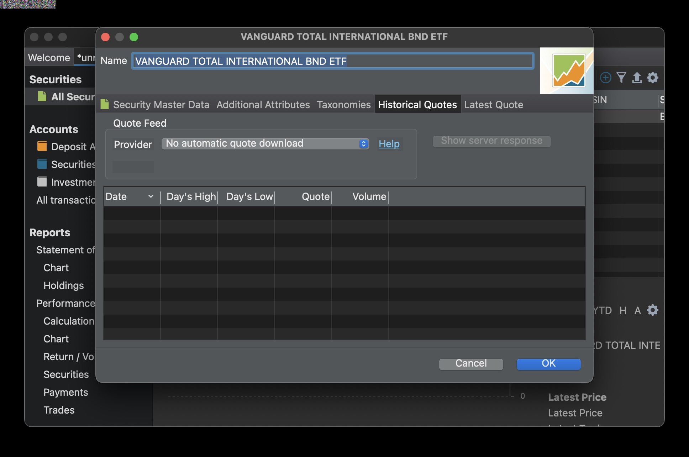

    4. Choose "Finnhub" from the Provider drop list. Historical prices will then be retrieved. Then click on "OK" button.

    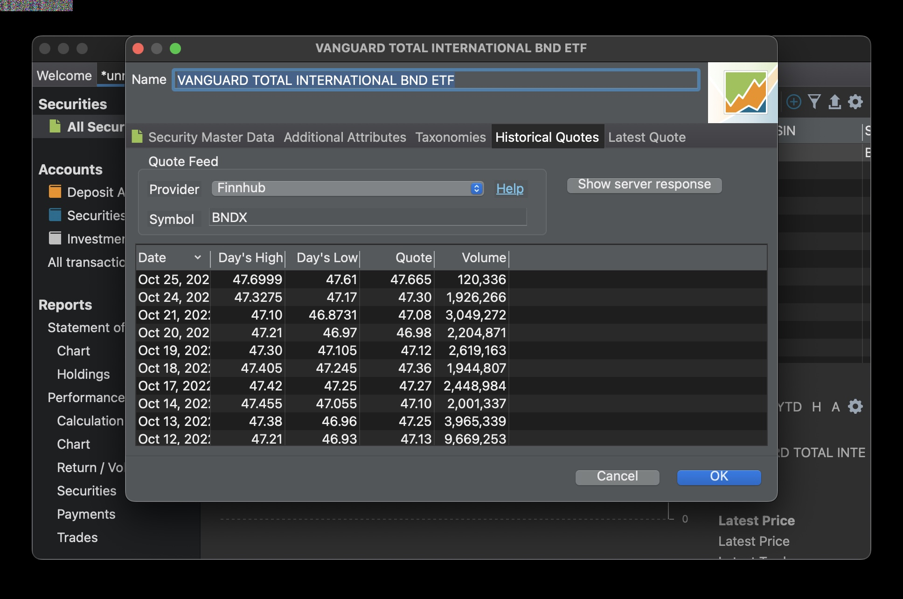

    5. Repeat this for other securities in the account. Note that this only needs to be done once for each new securities in the account. For example, repeat this when a new security is purchased. PP will retrieve historical prices automatically or you can manually do so via Online menu, Update Quotes.

12. Verify. Select "All transcations" from the tree menu on the left panel. Import complete.

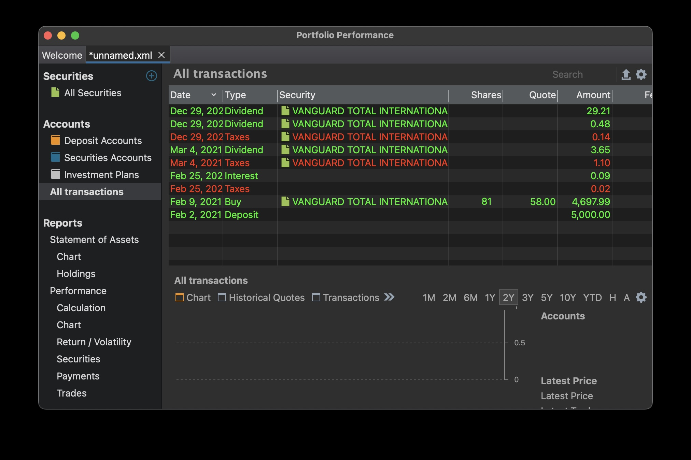
